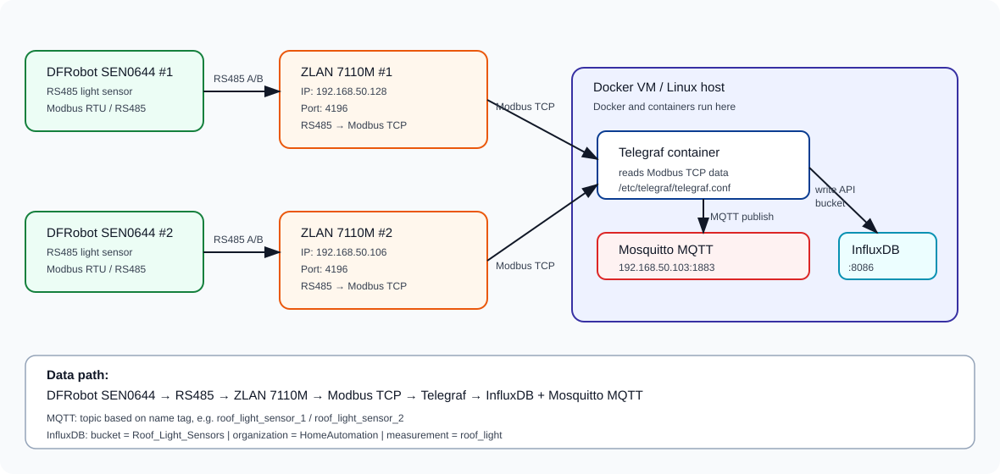

# DFRobots Light Sensor

Documentation for a home automation light sensing system using **DFRobot SEN0644** sensors connected via RS485 and ZLAN to a Telegraf Docker container, with output to InfluxDB and Mosquitto MQTT.

---

## Contents

1. [System architecture and visual diagram](#1-system-architecture-and-visual-diagram)
2. [Basic concepts](#2-basic-concepts)
3. [Creating a Docker container for Telegraf](#3-creating-a-docker-container-for-telegraf)
4. [The telegraf.conf configuration file](#4-the-telegraconf-configuration-file)
5. [First test via CPU metrics](#5-first-test-via-cpu-metrics)
6. [Connecting ZLAN devices via Modbus TCP](#6-connecting-zlan-devices-via-modbus-tcp)
7. [Connecting Telegraf to Mosquitto MQTT Broker](#7-connecting-telegraf-to-mosquitto-mqtt-broker)
8. [Connecting Telegraf to InfluxDB](#8-connecting-telegraf-to-influxdb)
9. [Final working configuration](#9-final-working-configuration)
10. [Functionality check](#10-functionality-check)
11. [Troubleshooting – real errors and solutions](#11-troubleshooting--real-errors-and-solutions)
12. [Further possible extensions](#12-further-possible-extensions)

---

## 1. System architecture and visual diagram

The data path is:

```
DFRobot SEN0644 → RS485 → ZLAN 7110M → Modbus TCP → Telegraf Docker container → MQTT Mosquitto + InfluxDB
```



> **Diagram note:** Telegraf has two outputs simultaneously — it publishes current values to **Mosquitto MQTT** and writes time-series data to **InfluxDB** (bucket `Roof_Light_Sensors`).

---

## Documentation

Full step-by-step documentation is available in this repository:

- 🇬🇧 [`DFRobots_sensors_ZLAN_Modbus_Telegraf_InfluxDB_MosquittoMQTT_EN.html`](DFRobots_sensors_ZLAN_Modbus_Telegraf_InfluxDB_MosquittoMQTT_EN.html) — English
- 🇸🇰 [`DFRobots senzory_ZLAN_Modbus_Telegraf_InfluxDB_and_MosquittoMQTT.html`](DFRobots%20senzory_ZLAN_Modbus_Telegraf_InfluxDB_and_MosquittoMQTT.html) — Slovak

Additional ZLAN 7110M VirCom configuration:

- 🇬🇧 [`zlan_final_bus_monitor_correct_EN.html`](zlan_final_bus_monitor_correct_EN.html) — English
- 🇸🇰 [`zlan_final_bus_monitor_correct.html`](zlan_final_bus_monitor_correct.html) — Slovak
